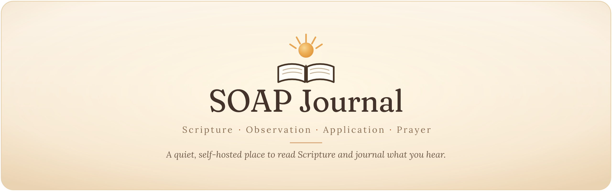
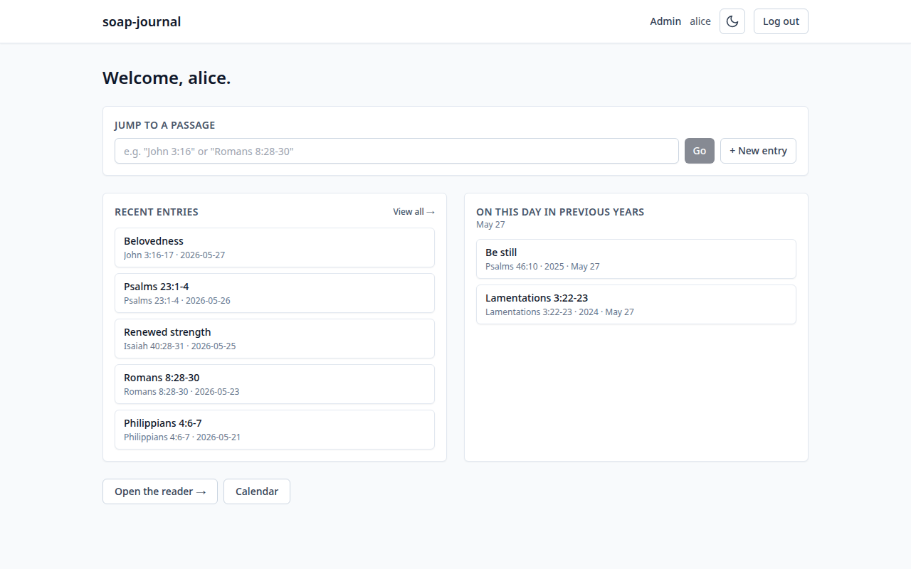
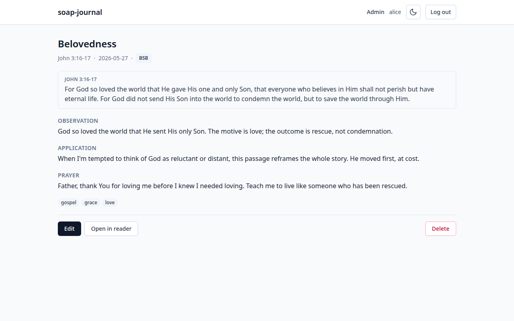

<p align="center">
  
</p>

<p align="center">
  <a href="LICENSE"></a>
  <a href="https://github.com/kbennett2000/soap-journal/releases/latest"></a>
</p>

soap-journal is a self-hosted journaling app built around the SOAP method
(**S**cripture, **O**bservation, **A**pplication, **P**rayer), with a full Bible
reader built in. It runs on your own Windows PC, Mac, or Linux server — your
entries never leave your machine, and once it's installed it works completely
offline. No accounts to sign up for, no subscription, no internet required.



---

## Get started

Setting it up takes about 20 minutes. **You don't need any technical
experience** — pick the kind of computer you'll run it on, and the guide walks
you through every step with screenshots:

- 🪟 **[Windows](docs/install/windows.md)** — run it on your Windows PC
- 🍎 **[Mac](docs/install/macos.md)** — run it on your Mac
- 🐧 **[Linux / home server](docs/install/ubuntu-server.md)** — run it 24/7 on an
  always-on machine for the whole household

📱 **On an Android phone or tablet?** There's a separate, standalone app —
**[SOAP Journal for Android](https://github.com/kbennett2000/soap-journal-mobile)** —
that runs entirely on your device, no server or computer needed.

Not sure which to choose, or want the overview first? Start at the
**[install guide](docs/install/README.md)**.

Already have it running? The **[usage guide](docs/usage/README.md)** is a friendly
tour of everything it can do.

---

## What you can do

- **Journal with the SOAP method** — write your Observation, Application, and
  Prayer; the Scripture text is pulled in for you automatically.
- **Read the Bible** — 13 translations included, side-by-side comparison, a quick
  "jump to a passage" bar, and verse or paragraph layouts.
- **Highlight verses** in six colors — across multiple verses, with optional notes.
- **Search everything** — your journal entries, and the full Bible text.
- **Find your way back** — tag entries, filter and browse them, see them on a
  calendar, and revisit "on this day in previous years."
- **Optional NET Bible** with inline translator's notes and tappable
  cross-references (you supply the source — see [Bibles](docs/bibles.md)).
- **Share with your household** — multiple users, each with their own private
  journal, managed by an admin.
- **Yours and private** — works on phones and computers alike, light and dark
  themes, and 100% offline with no telemetry once installed.

<details>
<summary>📸 A look around</summary>

<br>




</details>

---

## Documentation

- **[Install guide](docs/install/README.md)** — step-by-step setup for Windows,
  Mac, and Linux.
- **[Usage guide](docs/usage/README.md)** — how to read, journal, tag, search, and
  more.
- **[Configuration](docs/configuration.md)** — the handful of optional settings.
- **[Bibles](docs/bibles.md)** — what's included and how to add your own.
- **[Backups & updates](docs/usage/09-backups-and-updates.md)** — keep your
  journal safe.
- **[Troubleshooting](docs/install/troubleshooting.md)** — if something doesn't
  look right.

---

## For developers

soap-journal is a Python/FastAPI backend serving a React/TypeScript frontend,
packaged with Docker. Contributions that keep it small and self-hostable are
welcome.

<details>
<summary>Quick start (if you're comfortable with Docker)</summary>

<br>

```bash
git clone https://github.com/kbennett2000/soap-journal.git
cd soap-journal
cp .env.example .env        # Windows PowerShell: Copy-Item .env.example .env
docker compose up -d
```

Then open `http://localhost:8045`. The first user to register becomes the admin.
First boot loads the 13 bundled translations and takes a few minutes.

</details>

- **Running without Docker:** [Linux / macOS](docs/install/manual.md) ·
  [Windows](docs/install/windows-manual.md)
- **Contributing:** [`CONTRIBUTING.md`](CONTRIBUTING.md) — dev setup, tests,
  branch conventions, and the project's philosophy on scope.
- **Design:** [`SPEC.md`](SPEC.md) (the full specification),
  [`CLAUDE.md`](CLAUDE.md) (engineering conventions), and
  [`docs/adr/`](docs/adr/README.md) (architecture decision records).
- **Release notes:** [`CHANGELOG.md`](CHANGELOG.md).

---

## License

MIT — see [`LICENSE`](LICENSE). Third-party software notices live in
[`THIRD_PARTY_NOTICES.md`](THIRD_PARTY_NOTICES.md).
