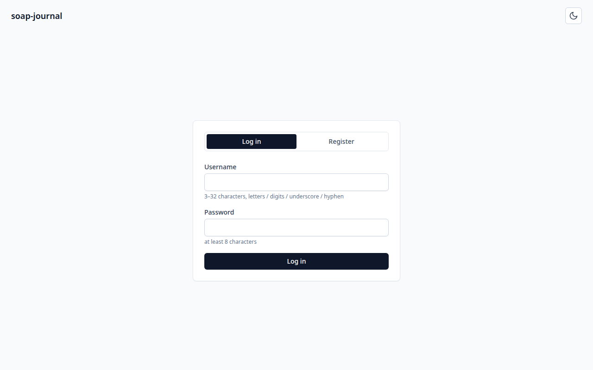
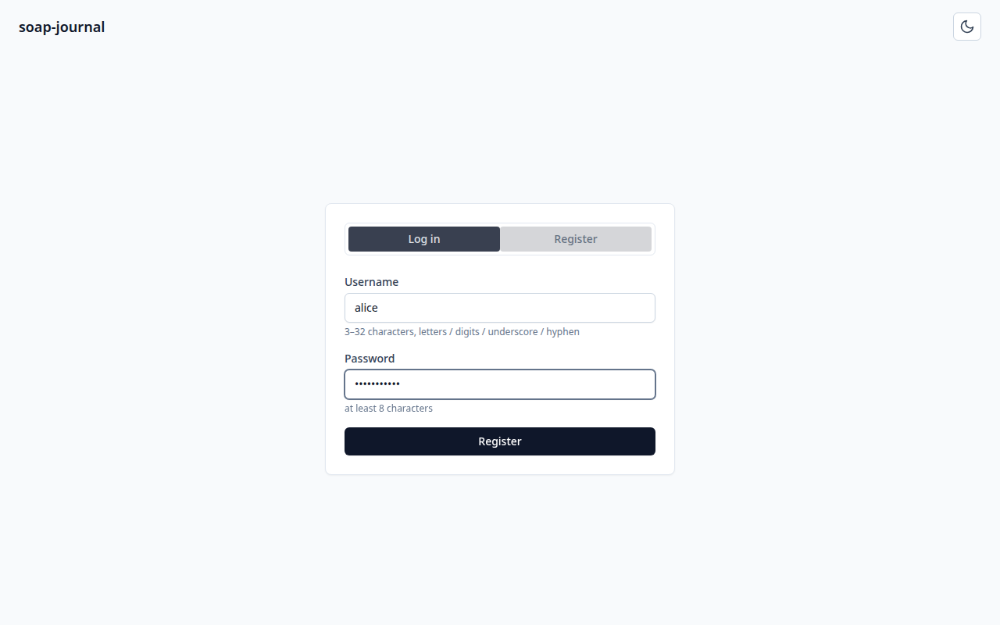
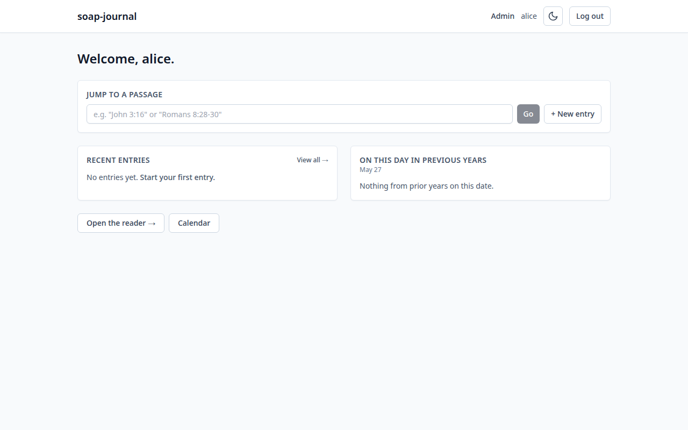

# Installing soap-journal on an Ubuntu Server

This guide walks you through installing soap-journal on a fresh Ubuntu
Server. It assumes you have never used Docker, never self-hosted anything,
and would rather have ten small steps explained than three big ones rushed.

By the end of this guide you will have soap-journal running on your home
network and you will be logged in as the administrator.

If you get stuck, see [`troubleshooting.md`](troubleshooting.md).

---

## What you will need

- **A computer running Ubuntu Server.** Versions **22.04 LTS** or
  **24.04 LTS** are tested. Other Linux distributions (Debian, Fedora,
  Raspberry Pi OS, etc.) will almost certainly work as long as Docker
  runs on them, but we only verify against Ubuntu Server LTS releases.
- **About 1 GB of free disk space.** The container image is roughly
  300 MB; the bundled Bible text and SQLite database take well under
  100 MB; the rest is headroom.
- **A way to type commands on that computer.** Either:
  - SSH access from your laptop (e.g. `ssh you@192.168.1.50`), or
  - Direct keyboard + monitor access to the server.
- **Internet access on the server during install.** soap-journal makes
  no outbound connections at runtime, but the install needs to download
  Docker and clone the repository. After install you can take the
  server offline entirely if you want.
- **The local IP address of your server**, e.g. `192.168.1.50`. You'll
  need this in the last step to open the app in your browser.

> **How to find your server's local IP address**
> Run this on the server:
> ```bash
> hostname -I
> ```
> You'll see output like `192.168.1.50 172.17.0.1`. The first one is
> usually your LAN address — that's what you want. If `hostname -I`
> isn't available, try `ip addr` and look for an `inet` line under
> your main network interface (often `eth0`, `enp3s0`, or `wlan0`).

---

## Step 1: Install Docker

Docker is what runs soap-journal. Think of it as a sandbox that bundles
everything the app needs to run — Python, a web server, the database —
into a single self-contained package, so you don't have to install any of
those pieces yourself.

We're going to install Docker from Docker's official repository. Ubuntu
ships with an older Docker package (`docker.io`); the official repo
gives you the current version with `docker compose` built in.

### 1.1 Update your package list

**What this does:** asks Ubuntu's package manager to refresh its index of
available software so you get the latest versions in the next steps.

```bash
sudo apt update
```

**What you should see:** several lines starting with `Hit:`, `Get:`, or
`Reading package lists...`, ending with something like
`X packages can be upgraded`. No errors.

**If you see this error:** `E: Could not get lock /var/lib/dpkg/lock-frontend` —
something else is using the package manager (maybe automatic updates).
Wait a minute and try again.

### 1.2 Install Docker's official install script

**What this does:** runs Docker's one-shot installer, which adds the
right repository for your Ubuntu version and installs Docker Engine,
the CLI, and the Compose plugin.

```bash
curl -fsSL https://get.docker.com | sudo sh
```

**What you should see:** several minutes of output as the script adds
Docker's apt repository and installs packages, ending with a summary
like `Docker version 27.x.x, build ...`.

**If you see this error:** `curl: command not found` — install curl
first with `sudo apt install -y curl`, then re-run the line above.

**If you see this error:** `Unsupported distribution` — your Ubuntu
version is older than the script supports. Upgrade to 22.04 or newer,
or follow Docker's manual install instructions at
<https://docs.docker.com/engine/install/ubuntu/>.

### 1.3 Add your user to the `docker` group

By default, only `root` can talk to Docker. Adding yourself to the
`docker` group means you can run `docker` commands without typing
`sudo` every time.

**What this does:** adds your current user account to the `docker`
group.

```bash
sudo usermod -aG docker $USER
```

**What you should see:** nothing — `usermod` is silent on success.

> ⚠️ **Important:** this change does not take effect until you log out
> and log back in (or close and reopen your SSH connection). The
> simplest way is:
> ```bash
> exit
> ```
> Then SSH back in (or open a new terminal). To check it worked:
> ```bash
> groups
> ```
> You should see `docker` listed.

### 1.4 Verify Docker works

**What this does:** asks Docker to print its version. If this works,
Docker is installed and you have permission to use it.

```bash
docker --version
docker compose version
```

**What you should see:** two lines, something like
```
Docker version 27.3.1, build ce12230
Docker Compose version v2.29.7
```

**If you see this error:** `permission denied while trying to connect
to the Docker daemon socket` — you skipped the log-out-and-back-in
step above. Run `exit` and reconnect.

**If you see this error:** `docker: command not found` — the install
script failed silently. Re-run step 1.2 and watch the output carefully
for errors.

---

## Step 2: Download soap-journal

### 2.1 Install git

**What this does:** installs `git`, the tool we'll use to download the
soap-journal source code.

```bash
sudo apt install -y git
```

**What you should see:** apt installs `git` and a handful of supporting
packages, then returns to the prompt. If `git` is already installed
you'll see `git is already the newest version`.

### 2.2 Clone the soap-journal repository

**What this does:** downloads a copy of the soap-journal source code
into a new folder called `soap-journal` in your home directory.

```bash
cd ~
git clone https://github.com/kbennett2000/soap-journal.git
cd soap-journal
```

**What you should see:** output like
```
Cloning into 'soap-journal'...
remote: Enumerating objects: 1234, done.
remote: Counting objects: 100% (1234/1234), done.
...
Receiving objects: 100% (1234/1234), 5.67 MiB | 12.34 MiB/s, done.
```
Then your prompt should change to show you're inside the `soap-journal`
directory.

**If you see this error:** `fatal: destination path 'soap-journal'
already exists` — you've cloned this before. Either `cd soap-journal`
and use what's there, or delete it with `rm -rf soap-journal` and try
again.

### 2.3 Look around (optional)

You're now inside the project folder. If you're curious what's in
there:

```bash
ls
```

You'll see files like `docker-compose.yml`, `Dockerfile`, `.env.example`,
`README.md`, and folders called `backend`, `frontend`, `bible-sources`,
and `scripts`. You don't need to understand any of these — Docker will
read them for you.

---

## Step 3: Configure soap-journal

soap-journal reads its configuration from a file called `.env` in the
project root. The repository ships with `.env.example` showing the
available settings; you copy that to `.env` and edit anything you want
to change.

### 3.1 Create your `.env` file

**What this does:** copies the example settings file to `.env`, which
is the name Docker actually looks for.

```bash
cp .env.example .env
```

**What you should see:** nothing — `cp` is silent on success.

### 3.2 Open `.env` in an editor

**What this does:** opens the file in `nano`, a friendly terminal
editor. (If you prefer `vim` or `emacs`, use whichever you like.)

```bash
nano .env
```

You'll see something like this:

```ini
# Port published to the host
PORT=8045

# Session signing key. Generated automatically on first run if blank.
# Stored in {DATA_DIR}/.secret_key — keep that file private.
SECRET_KEY=

# (Advanced) override the data directory inside the container...
# DATA_DIR=/data

# Note: self-registration is controlled at runtime through the admin API
# (PUT /api/v1/admin/settings), not via env...
```

### 3.3 Walk through each setting

- **`PORT=8045`** — the port number you'll type in your browser to
  reach soap-journal. The default `8045` is unusual on purpose: most
  common ports (80, 8080, 3000) are already taken by other things on a
  typical home server. If `8045` is already in use, change it to any
  unused port between 1024 and 65535 (e.g. `PORT=8055`).
- **`SECRET_KEY=`** — used internally to sign your login cookie. Leave
  this blank; soap-journal will generate a random one for you on first
  boot and remember it from then on. Only set this yourself if you have
  a strong reason.
- **`DATA_DIR`** — leave commented out (the `#` at the start makes it a
  comment). The default of `/data` is right for the Docker setup.

For a default install, you don't need to change anything. Just keep
reading.

### 3.4 Save and exit nano

If you made changes (or even if you didn't):

1. Press **Ctrl + O** (the letter O, for "output"). nano will ask
   "File Name to Write: .env" — just press **Enter** to confirm.
2. Press **Ctrl + X** to exit.

If nano asks "Save modified buffer?" and you don't want to save, press
**N**. If you do want to save, press **Y**, then **Enter**.

---

## Step 4: Start the service

### 4.1 Build and start the container

**What this does:** tells Docker to read `docker-compose.yml`, build
the soap-journal container if it doesn't already exist, and start it
in the background.

```bash
docker compose up -d
```

The `-d` flag means "detached" — the container runs in the background
and you get your terminal back. Without `-d`, the container's logs
would pour into your terminal and Ctrl + C would stop the container.

**What you should see:** the first time you run this, Docker downloads
base images (Node 20, Python 3.12), then runs the build steps. This
takes 2–5 minutes on a typical home server. You'll see a lot of
progress output like:

```
[+] Building 134.5s (24/24) FINISHED
 => [internal] load build definition from Dockerfile
 => [internal] load .dockerignore
 => [frontend-build 1/5] FROM docker.io/library/node:20-alpine
 ...
 => => exporting to image
[+] Running 1/1
 ✔ Container soap-journal Started
```

If you re-run `docker compose up -d` later (after a code update, say),
it skips the parts it has already done and is much faster.

**If you see this error:** `error during connect: ... permission denied` —
your user isn't in the `docker` group yet. Go back to step 1.3.

**If you see this error:** `Bind for 0.0.0.0:8045 failed: port is
already allocated` — something else on your server is using port 8045.
Either stop that other thing, or change `PORT` in `.env` to something
else (e.g. `PORT=8055`) and re-run `docker compose up -d`.

### 4.2 Check that the container is healthy

**What this does:** lists the containers Docker is currently running
and their health status.

```bash
docker compose ps
```

**What you should see:** one line, something like

```
NAME           IMAGE                COMMAND                  SERVICE        CREATED         STATUS                    PORTS
soap-journal   soap-journal:local   "/usr/local/bin/dock…"   soap-journal   30 seconds ago  Up 30 seconds (healthy)   0.0.0.0:8045->8080/tcp
```

The key word is **`(healthy)`** in the STATUS column. That means
soap-journal has finished starting up and is responding to internal
health checks.

If the STATUS says `(health: starting)`, give it 20 more seconds and
re-run `docker compose ps`. The first boot loads the Bible text into
the database, which takes a moment.

If the STATUS says `Restarting`, something is wrong. Skip to step
4.3 to read the logs.

### 4.3 View the logs (optional, but recommended for the first start)

**What this does:** streams the container's logs to your terminal so
you can see what soap-journal is doing.

```bash
docker compose logs -f
```

The `-f` flag means "follow" — new log lines appear as they happen.

**What you should see on a healthy first start:**

```
soap-journal  | [entrypoint] running as soap (uid 1000)
soap-journal  | [entrypoint] data dir: /data
soap-journal  | [entrypoint] running alembic migrations
soap-journal  | INFO  [alembic.runtime.migration] Running upgrade ...
soap-journal  | [entrypoint] no translations loaded — parsing bundled BSB
soap-journal  | [entrypoint] loading BSB into the database
soap-journal  | [entrypoint] starting: uvicorn ...
soap-journal  | INFO:     Started server process [1]
soap-journal  | INFO:     Application startup complete.
soap-journal  | INFO:     Uvicorn running on http://0.0.0.0:8080
```

Those last three `INFO` lines mean soap-journal is up and listening.

**Press Ctrl + C to stop following the logs.** That stops the log
stream; it does **not** stop the container. The container keeps running
in the background.

---

## Step 5: Open soap-journal in your browser

On any device on your home network — your laptop, a phone, a tablet —
open a web browser.

In the address bar, type:

```
http://<your-server-ip>:8045
```

For example, if your server's IP is `192.168.1.50` and you kept the
default port, you'd type `http://192.168.1.50:8045`.

### 5.1 The login page

You should see this:



If the page doesn't load, see
[`troubleshooting.md#i-cant-reach-the-server-from-my-browser`](troubleshooting.md#i-cant-reach-the-server-from-my-browser).

### 5.2 Register the first user

The first user to register on a fresh install **becomes the
administrator** — they can create other users, reset passwords, and
flip settings. Make this you.

1. Click the **Register** tab.
2. Choose a username (3–32 characters, letters / digits / underscore /
   hyphen).
3. Choose a password (at least 8 characters). Pick something you'll
   remember; there is no self-service password reset.
4. The filled-in form looks like this:

   

5. Click the **Register** button.

### 5.3 You're in

You'll land on the dashboard:



The dashboard is your home base. Right now it's empty because you
haven't written any journal entries yet. That's the next chapter.

---

## You're done. What now?

soap-journal is installed and you're logged in as the admin. A few
things to do next:

1. **Bookmark the URL** (`http://<your-server-ip>:8045`) on every
   device you'll use to journal.
2. **Read the [usage guide](../usage/README.md)** to learn what each
   screen does.
3. **Set up backups.** The file
   [`docs/usage/09-backups-and-updates.md`](../usage/09-backups-and-updates.md)
   shows you how. The short version: copy the `data/` folder
   periodically.
4. **Decide whether to allow other people to register accounts.** By
   default registration is closed after the first user signs up, so
   nobody else can create an account without you. If you live with
   other people who want their own journals, see
   [`docs/usage/08-admin-tasks.md`](../usage/08-admin-tasks.md) for
   how to either turn on open registration or create accounts for them
   directly.

---

## For developers

The auto-generated OpenAPI schema for the HTTP API lives at
`http://<your-server-ip>:8045/docs` (Swagger UI) and
`http://<your-server-ip>:8045/redoc` (ReDoc). This is for people writing
code against the API, not for normal use of the app.
