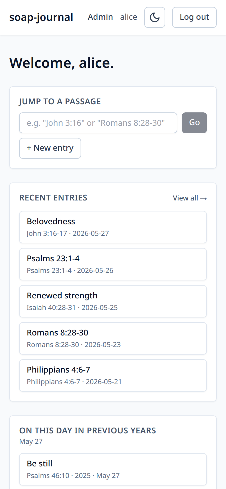

# 2. The dashboard

Once you log in, you land on the dashboard:

It has four parts, top to bottom.

## The top bar

Across the top of every screen:

- **soap-journal** (left) — clicking the title takes you back to this
  dashboard from anywhere.
- **Admin** (right, only if you're an administrator) — opens the admin
  area. See [chapter 8](08-admin-tasks.md).
- **Your username** (right) — a small reminder of which account you're
  signed in as.
- **Theme toggle** (the moon / sun icon) — switches between light and
  dark theme. Saved in your browser; each device remembers its own
  preference.
- **Log out** (right) — see [chapter 1](01-first-login.md).

## Jump to a passage

The bar at the top of the dashboard takes any Bible reference and jumps
straight to the reader at that passage:

- `John 3:16`
- `John 3:16-20`
- `Jn 3` (book abbreviations are accepted)
- `1Cor 13:4-7`
- `Rom 8:28-30`

If you type something the parser doesn't recognise, you'll get an
inline error message. See [chapter 3](03-reading-the-bible.md) for the
full reference syntax.

There's also a **+ New entry** button to the right of the jump bar —
that takes you straight to the entry form with no reference pre-filled.

## Recent entries

Your five most recently created or edited entries. Each row shows:

- The entry's title (or, if you didn't give it one, the auto-generated
  title built from the Scripture reference).
- The reference and date.

Click any entry to open it. The **View all →** link in the corner takes
you to the full entries list (see [chapter 5](05-finding-entries.md)).

If you have no entries yet, this panel says **"No entries yet. Start
your first entry."** and the link takes you to the new-entry form.

## On this day in previous years

The right-hand panel surfaces entries you wrote on this same calendar
date in prior years — same month and day, any year before this one. A
gentle way to reread what you were chewing on a year or two ago.

If nothing matches, the panel says **"Nothing from prior years on this
date."**

## Quick links

Below the two panels:

- **Open the reader →** — opens the Bible reader, starting from the
  last chapter you were reading (or Genesis 1 if it's your first time).
- **Calendar** — opens the calendar view of your entries.

## Mobile layout

On a phone, the two side-by-side panels (recent / on this day) stack
vertically. Everything else works the same.

---

Previous: [First login](01-first-login.md) · Next: [Reading the Bible →](03-reading-the-bible.md)
