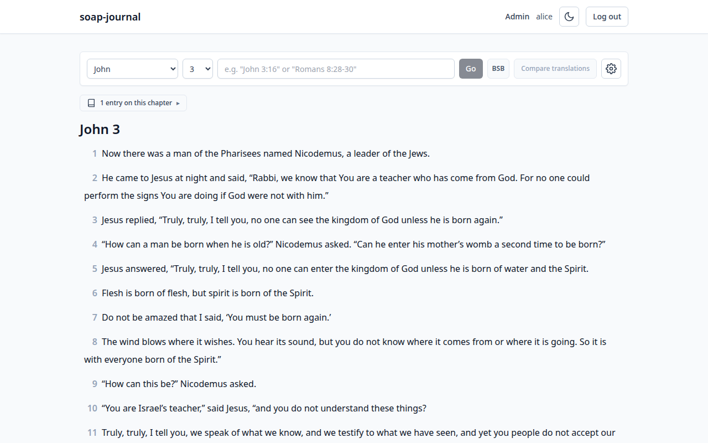
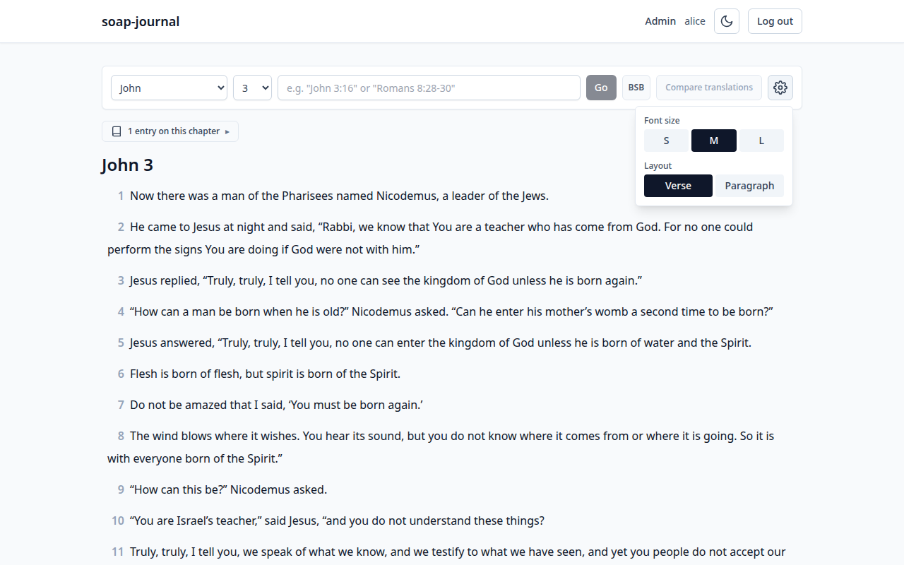
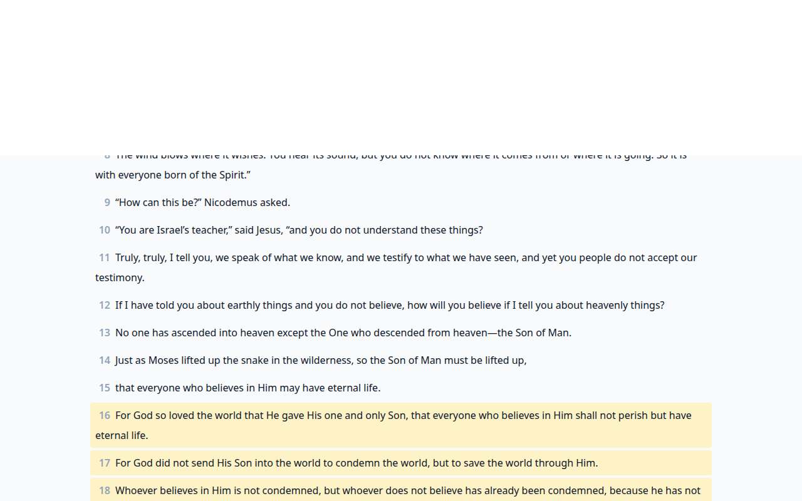
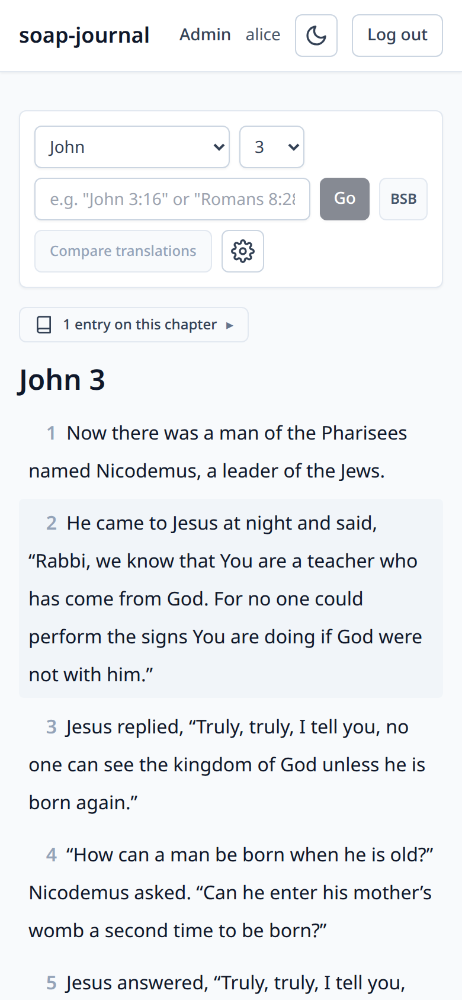

# 3. Reading the Bible

soap-journal ships with 13 public-domain Bible translations — including
the **Berean Standard Bible (BSB)**, the **King James Version (KJV)**, the
**World English Bible (WEB)**, and **Young's Literal Translation (YLT)**.
They're all loaded automatically when the container first boots. The
reader is the screen for actually reading them.

You can also add the **NET Bible** (New English Translation) — see
[Adding your own translation](../bibles.md#adding-your-own-translation).
NET is the one translation that carries inline **translator's notes** and
**cross-references**; once it's loaded, the reader shows them (see
[Translator's notes](#translators-notes-and-cross-references) below).

Open it from the dashboard's **Open the reader →** button, by typing a
reference into the jump bar, or by clicking the soap-journal title and
then navigating from there.

## The controls bar

Across the top of the reader:

- **Book picker** (left dropdown) — Old and New Testament books are
  grouped separately. Pick a book to jump to its first chapter.
- **Chapter picker** (next dropdown) — pick a chapter within the
  current book.
- **Jump bar** — type a free-form reference (`John 3:16`, `1 Cor 13`,
  `Rom 8:28-30`). Press Enter or click **Go**.
- **Translation badge** (small badge with the translation code, e.g.
  `BSB`) — shows which translation is currently being displayed, and
  lets you switch to any other loaded translation.
- **Compare translations** — opens a side-by-side view so you can read
  two translations in parallel. It's active out of the box since the app
  ships with 13 translations. (If you've loaded an additional copyrighted
  translation like ESV or NLT, it shows up here too.)
- **Settings** (gear icon) — opens a small popover with font-size and
  layout options. See [Reader settings](#reader-settings) below.

## Reference syntax

The jump bar (and the dashboard jump bar, and the Scripture reference
field on the entry form) all accept the same shapes:

| Reference | What it means |
| --- | --- |
| `John 3:16` | Single verse |
| `John 3:16-20` | A range of verses |
| `John 3` | Whole chapter |
| `Jn 3:16` | Abbreviated book name |
| `1 Cor 13:4-7` | Numbered book |
| `1Cor 13:4-7` | Spaceless numbered book |
| `Rom 8:28-30` | Three-letter book abbreviation |

Book names are matched case-insensitively against the loaded
translation, so `john`, `John`, and `JOHN` all work.

If the parser can't make sense of what you typed, you'll see an inline
"Couldn't read that reference" message. The most common cause is a
typo in the book name.

## Navigating chapters

After loading a chapter, the bottom of the page has:

- **← Previous: <book> <chapter>** — the chapter before this one.
- **Next: <book> <chapter> →** — the chapter after this one.

If you're at the very first chapter of Genesis or the last chapter of
Revelation, the corresponding button is disabled.

You can also use the **left arrow** and **right arrow** keys on your
keyboard to move between chapters (as long as you're not typing in an
input field).

## Reader settings

Click the gear icon at the right end of the controls bar:

Two settings, both saved per-device in your browser:

- **Font size** — **S**, **M**, or **L**. Pick whatever's easiest on
  your eyes. The default is M.
- **Layout** — **Verse** puts each verse on its own line with the verse
  number in the margin (the default; good for slow study). **Paragraph**
  flows verses together into prose-style paragraphs broken by section
  headings (good for reading at speed).

Section headings (like *"The Visit of Nicodemus"* before John 3) come
from the translation. They're not part of the inspired text — they're
editorial signposts that help you find your place.

## Translator's notes and cross-references

When you're reading a translation that carries translator's notes — the
**NET Bible** — small superscript markers appear inline in the verse text
at the spot each note applies to. (The bundled public-domain translations
have no such notes, so you won't see markers there.)

Click a marker to open the note. It shows:

- The note's **type** — Translator's Note, Study Note, Text-Critical
  Note, or Map.
- The note **body**.
- Any **cross-references** the note makes — each is a link like
  *John 1:1*. Click one to jump straight to that passage in the reader
  (it opens with the cited verses highlighted, just like the jump bar).

Clicking a marker only opens its note — it doesn't start a new entry the
way clicking the verse number does.

## Highlighting verses

Select any run of verse text with your mouse (or by dragging on a
touchscreen) and a small color palette pops up. Pick one of six colors
and that text is highlighted. A highlight can:

- **Span multiple verses** within a chapter — drag across as many as you
  like.
- **Overlap** other highlights. Where highlights stack, the most recent
  color shows and a small **+N** badge marks how many others are
  underneath.
- Carry an **optional note** — a private plain-text comment attached to
  the highlight.

To change or remove a highlight, **click it**. An annotation panel opens
(a side panel on desktop, a slide-up sheet on phones) where you can pick
a different color, type or edit the note, or **delete** the highlight.
Deleting one that has a note asks you to confirm first.

Highlights are **per translation**: a highlight you make while reading NET
shows only in NET, not in BSB or KJV, because it's pinned to the exact
wording you highlighted. Switch translations and it quietly hides; switch
back and it returns.

> The verse **number** is still the "start a new journal entry" control —
> tap it (it's an easy target on touch) to open the entry form. Selecting
> text is for highlighting; tapping the number is for journaling.

## Searching scripture

The **🔍 Search Scripture** button in the controls bar opens a search over
the **Bible text itself** — verse text and (for NET) translator's notes.
This is different from the search on the entries list, which searches
*your journal* ([chapter 5](05-finding-entries.md)).

- Results come back as two lists: **verse** matches and **note** matches,
  each with the matched words highlighted and a link into the reader.
- By default it searches the **current translation**. Switch it to **All**
  to search every loaded translation at once; cross-translation verse
  matches are grouped so a verse shows once with the translations that
  matched it.

## Highlighted verses after a jump

When you arrive at the reader via a verse-range reference (e.g.
`John 3:16-20`), the reader scrolls to that range and highlights the
matching verses with a soft yellow background:

The highlight is just to draw your eye; it doesn't affect anything
else. Scroll up to see the rest of the chapter, or use the navigation
arrows to move between chapters as normal.

## Clicking a verse to journal on it

Click any verse and soap-journal opens the new-entry form with that
verse pre-filled as the Scripture reference. See
[chapter 4](04-creating-entries.md).

## Cross-references back to your journal

If you've already written entries on the chapter you're reading, a
small badge appears below the controls bar that reads
**"N entries on this chapter ▸"**. Click it to expand a list of your
entries on this passage; click any of them to open it.

The badge only shows for the *current user* — your entries, not
anyone else's.

## Omitted verses

A few verses in the New Testament don't appear in the earliest manuscripts
(e.g. John 5:4, Acts 8:37). Modern translations like BSB omit them from
the main text. When you scroll past one, you'll see a small placeholder:

> *[Verse omitted in earliest manuscripts.]*

This is not a bug. The verse number is preserved so that any reference
you have memorised still lands you at the right spot in the chapter;
the placeholder tells you why there's no text to read.

## Mobile layout

The reader is fully responsive. On a phone, the controls bar wraps to
two rows and the verse text fills the screen width:

---

Previous: [The dashboard](02-the-dashboard.md) · Next: [Creating entries →](04-creating-entries.md)
