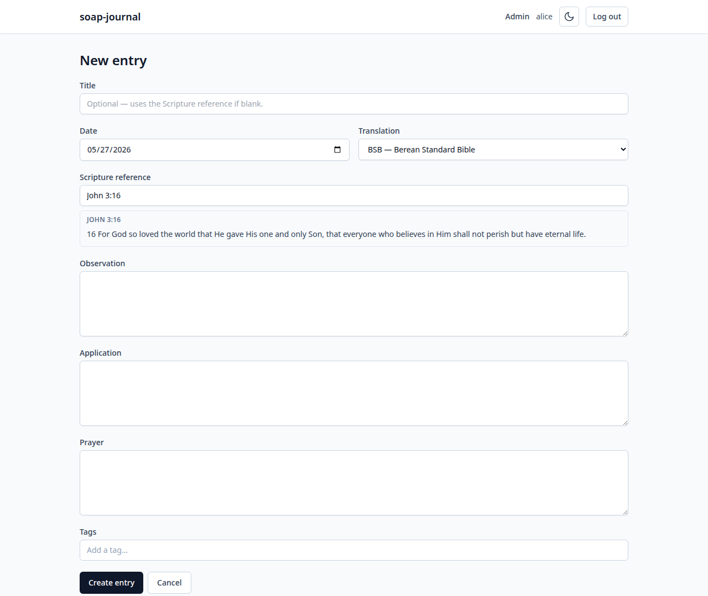
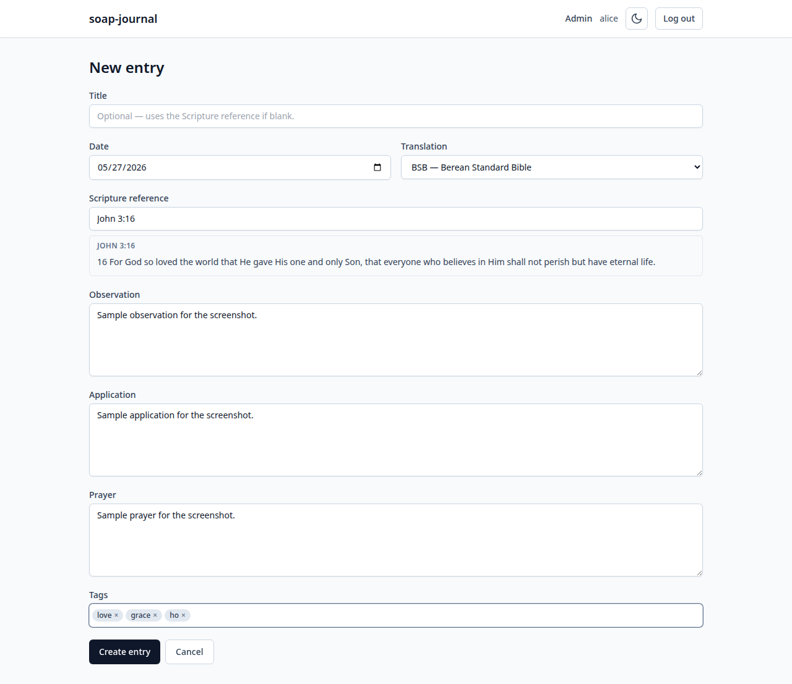
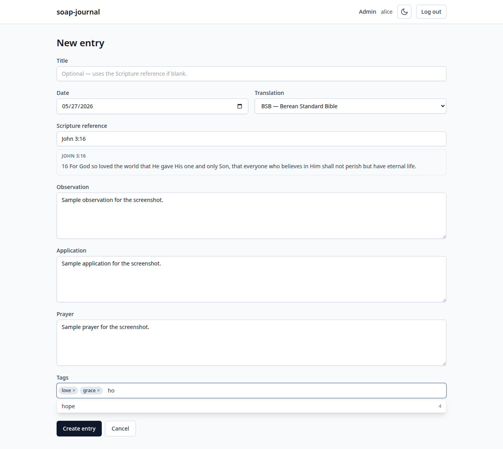
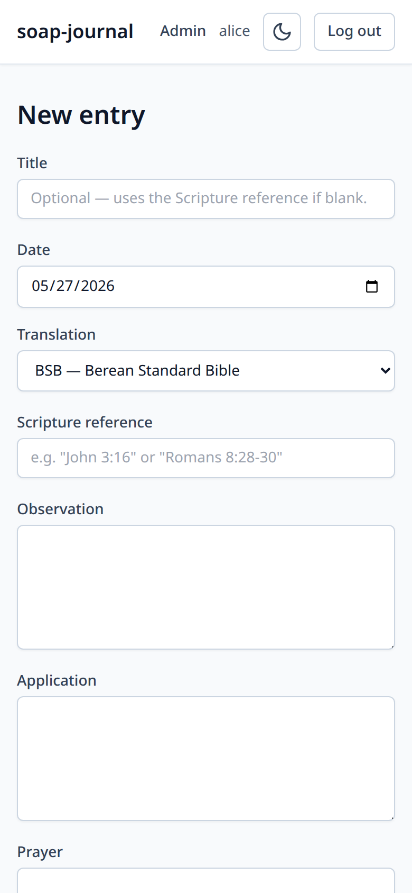

# 4. Creating entries

The point of soap-journal is to write SOAP entries. This chapter walks
through what SOAP is, the two ways to start an entry, every field on
the entry form, and how to edit or delete entries later.

## What "SOAP" stands for

SOAP is a four-step method for reflecting on a passage of Scripture.
Each letter prompts one section of the entry:

- **S — Scripture.** Pick a passage. It can be one verse or a few; the
  point is to *narrow your focus*, not cover an entire chapter.
- **O — Observation.** What does the passage say? Read it more than
  once, slowly. Notice the verbs, the order, the words that surprise
  you. Don't interpret yet — just describe.
- **A — Application.** What does it mean for *you, today*? Where is
  this passage asking you to think, decide, or act differently? Be
  concrete; "I'll be more loving" is harder to live with than "I'll
  call my sister this week."
- **P — Prayer.** Talk to God in response to what you just observed
  and how you intend to apply it. A few sentences is plenty.

The method is associated with [Wayne Cordeiro](https://www.waynecordeiro.com/)
and has been used in churches and small groups for decades. It's
deliberately simple: any passage, any day, fifteen minutes.

soap-journal gives you a form for each of these four fields, plus some
metadata (title, date, tags) on top. You can fill them in any order —
the order they appear in the form just matches the SOAP acronym.

## Two ways to start an entry

### From the reader

The most natural workflow. Open the reader, navigate to a chapter,
**click any verse**. soap-journal opens the new-entry form with that
verse pre-filled as the Scripture reference and the rest of the passage
preview already showing:

### From scratch

From the dashboard or the entries list, click **+ New entry**. The form
opens empty; type your reference into the **Scripture reference** field
and the preview will fill in as soon as you type something valid.

## The entry form, field by field

### Title

Optional. A short name for the entry — *"Belovedness"*, *"First and
great"*, anything memorable.

**If you leave it blank**, soap-journal auto-generates a title from the
Scripture reference (e.g. *"John 3:16-17"*). You can always go back
later and add a real title.

### Date

Defaults to today. Click the field to change it — you might be writing
about something you read yesterday, or backfilling an old entry from a
paper journal.

The date is what the **calendar view** and **"on this day in previous
years"** use to find your entries.

### Translation

Which translation the Scripture text is pulled from. v0.1 ships with
only BSB, so this is fixed; the field is here so that when a second
translation is loaded later, you can choose.

### Scripture reference

The passage you're reflecting on. Any of the reference shapes from
[chapter 3](03-reading-the-bible.md) work here: `John 3:16`, `Jn 3`,
`1Cor 13:4-7`, `Rom 8:28-30`, etc.

As you type, the **preview panel** below the field updates to show the
actual verse text from your selected translation. If you typed something
the parser doesn't recognise, you'll see an inline error here.

The verse text in the preview is *snapshotted into the entry* when you
save. Even if you later edit the reference, the saved text reflects
what the translation said at the moment you saved. This matters for
two reasons:

- You'll always see exactly the words you were reflecting on, in
  context, even if the translation file is later updated or replaced.
- It means search across entries also searches the Scripture text you
  saved (see [chapter 5](05-finding-entries.md)).

### Observation

What does the passage say? A multi-line text area, no length limit.
This is where you slow down — describe what you notice before you
interpret it.

### Application

What does it mean for you, today? Same format as Observation.

### Prayer

Your written prayer in response. Same format.

### Tags

Free-form categories you make up for yourself. See
[chapter 6](06-tags.md) for the full story. Briefly:

- Type a word, press **Enter** (or **Tab**, or `,`) to add it as a
  chip.
- Click the **×** on a chip to remove it.
- Start typing and a list of your previously-used tags pops up so you
  can pick one for consistency (and so the same idea doesn't end up
  spread across `prayer`, `prayers`, and `Prayer`).

Tags are **per user** — yours are private to your account.

## Saving

The **Create entry** button at the bottom saves the entry and takes you
to the entry detail page (see [chapter 5](05-finding-entries.md)).

The **Cancel** button discards what you typed and returns you to the
previous screen.

## Editing later

Open any entry. The detail page has an **Edit** button. The form is
identical to the new-entry form, with your existing values filled in.
Save replaces the entry; cancel discards your edits.

If you edit the Scripture reference, the verse text snapshot is
refreshed to match the new reference, in the current translation.

## Deleting

The detail page also has a **Delete** button. Click it and you'll be
asked to confirm — entries are gone for good once deleted, so the
confirmation is there on purpose.

There is no "undo delete" and no "trash bin" in v0.1. If you want to
keep a copy before deleting, copy the text out manually first, or back
up your `data/` folder (see
[chapter 9](09-backups-and-updates.md)).

## Mobile

The entry form on a phone stacks the date and translation fields and
makes every text area full-width. The keyboard takes up about a third
of the screen while you type:

> 💡 Prefer a dedicated phone app? **[SOAP Journal for Android](https://github.com/kbennett2000/soap-journal-mobile)**
> is a separate, standalone app that runs on the phone itself — no server needed.

---

Previous: [Reading the Bible](03-reading-the-bible.md) · Next: [Finding entries →](05-finding-entries.md)
