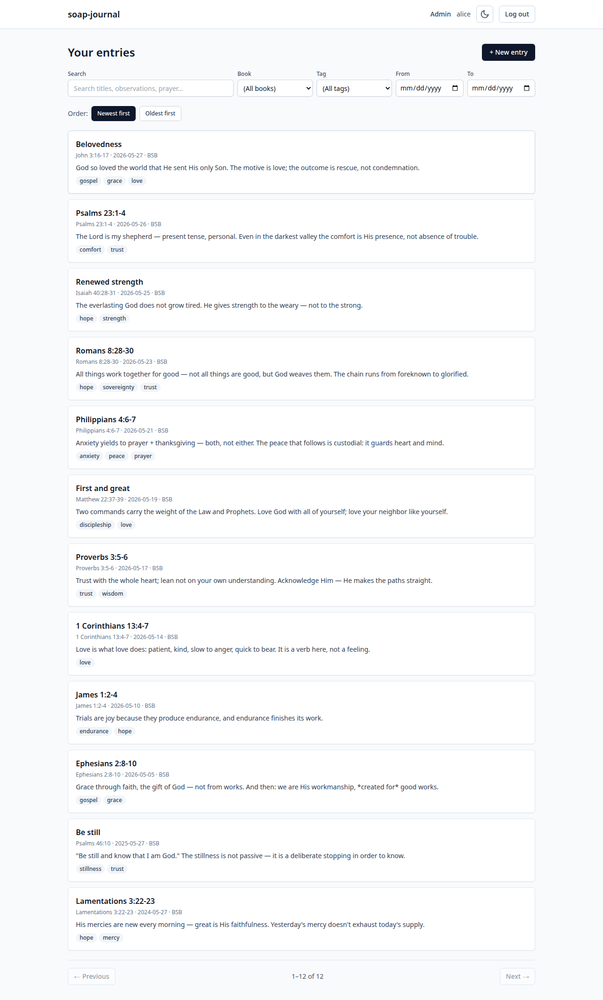
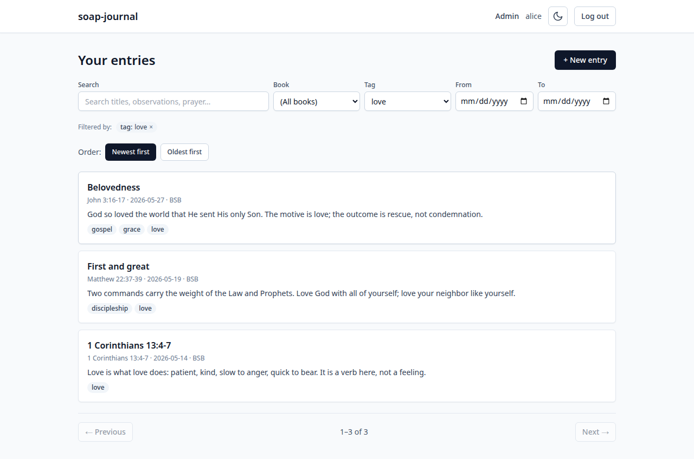

# 5. Finding entries

Click **+ View all →** on the dashboard, or visit the URL ending in
`/entries`, to see your full journal:



Each entry shows its title, Scripture reference, date, translation
code, the opening sentence of your observation, and its tags.

## Searching

The **Search** box at the top searches across these fields of every
entry of yours:

- Title
- Observation
- Application
- Prayer
- The Scripture text that was snapshotted into the entry

Search is case-insensitive substring match. Type a word or short phrase
and the list filters as you type. Searching for `love` brings back
every entry that mentions love anywhere — in your observation, your
prayer, the verse text, or the title.

## Filters

To the right of the search box:

- **Book** — limits the list to entries on a specific book of the
  Bible. The dropdown lists every book you have at least one entry on.
- **Tag** — limits the list to entries with a specific tag. The
  dropdown lists every tag you've used.
- **From** / **To** — limits the list to entries whose date falls in
  the chosen range. You can leave one side blank to mean "everything
  before" or "everything after."

You can combine any of these. Search + Book + Tag + Date range all
narrow the list together.

## Applied filter chips

When any filter is active, the **Filtered by:** row below the controls
shows a chip for each one:



Click the **×** on any chip to remove that filter. Removing all chips
returns you to the unfiltered list.

## Ordering

Two buttons below the filter chips:

- **Newest first** (the default) — most recent entries at the top.
- **Oldest first** — sorted by date ascending, useful for re-reading
  what you wrote at the beginning of a season.

## Pagination

The list shows 20 entries at a time. **← Previous** and **Next →**
buttons appear at the bottom, with a `1–20 of 47` counter between
them. If your library is smaller than a page, the buttons are disabled
and the counter just says `1–N of N`.

## Bookmarkable URLs

The filters and search live in the URL. If you bookmark a filtered
view, opening the bookmark later runs the same filter again. For
example:

```
/entries?tag=love
/entries?book=Psalms&from_date=2025-01-01
/entries?q=mercy
```

This is also how you can build your own "saved searches" by hand —
just bookmark the URL.

## Entry detail

Click any entry to open its detail page:


The detail page is read-only. From here you can:

- **Edit** — open the entry form with these values pre-filled.
- **Open in reader** — jump to the Scripture reference in the Bible
  reader.
- **Delete** — remove the entry (with a confirmation step).

---

Previous: [Creating entries](04-creating-entries.md) · Next: [Tags →](06-tags.md)
