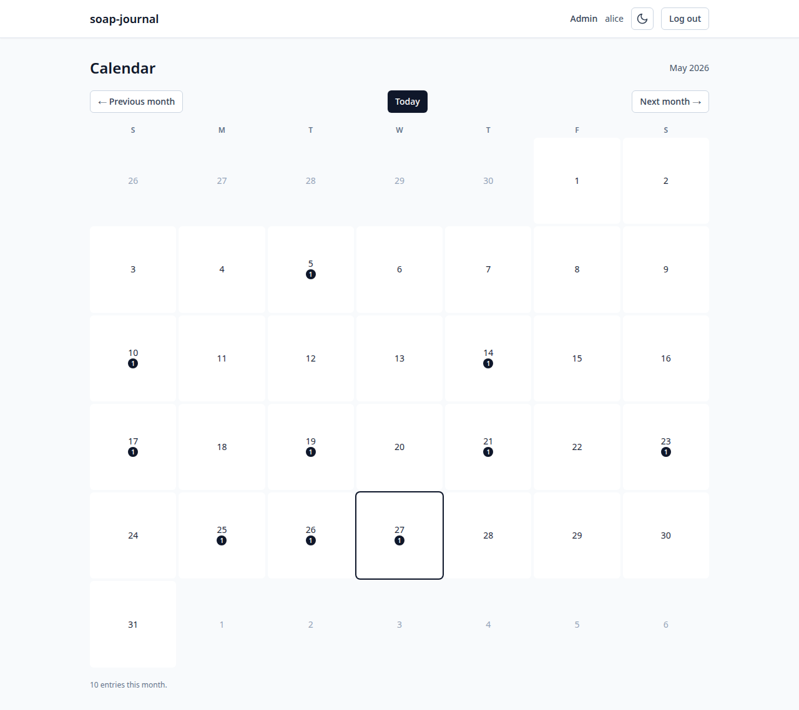

# 7. Calendar and "on this day"

Two date-centric views complement the search-and-filter list:

- The **calendar** shows your entries as dots on a month grid.
- The **"on this day in previous years"** panel on the dashboard
  surfaces past entries written on the same calendar date.

## The calendar

Click **Calendar** on the dashboard, or navigate to `/calendar`:

Each cell is one day. Days with entries show a small dot underneath
the date along with the number of entries that day. Today's date is
outlined with a black box so it's easy to find.

### Navigating months

The three buttons above the grid:

- **← Previous month** — go back one month.
- **Today** — jump to the current month.
- **Next month →** — go forward one month.

The current month and year ("May 2026") appears in the top-right of
the calendar header.

You can navigate as far back or forward as you like. Months in the
future are also navigable — useful for backfilling, e.g. if you write
an entry tonight that you want to date to tomorrow morning.

### Clicking a day

Click any day with entries on it and you'll be taken to the entries
list filtered to that single date. The URL contains the filter so you
can bookmark it.

Clicking a day with no entries does nothing.

### "N entries this month"

The line below the grid totals the entries for the displayed month.
Helpful for seeing your rhythm at a glance.

## "On this day in previous years" on the dashboard

The right-hand panel of the dashboard:

This matches entries by **month and day, in any prior year**. If today
is May 27, 2026, it shows entries you wrote on May 27, 2025, May 27,
2024, and so on — but not anything from earlier in May 2026.

If nothing matches, the panel says **"Nothing from prior years on
this date."**

This is the closest thing soap-journal has to a "re-discover" feature.
A year of entries comes around again every year; the dashboard puts
that in front of you on the days where it has something to offer.

How far back it looks defaults to a generous range (multiple years)
so even sparse journals surface occasionally. As your library grows,
you'll see more.

---

Previous: [Tags](06-tags.md) · Next: [Admin tasks →](08-admin-tasks.md)
