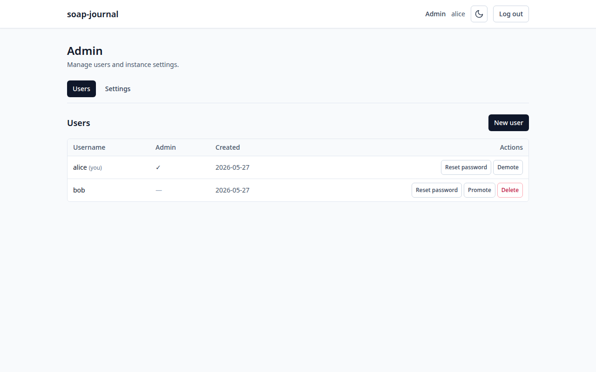
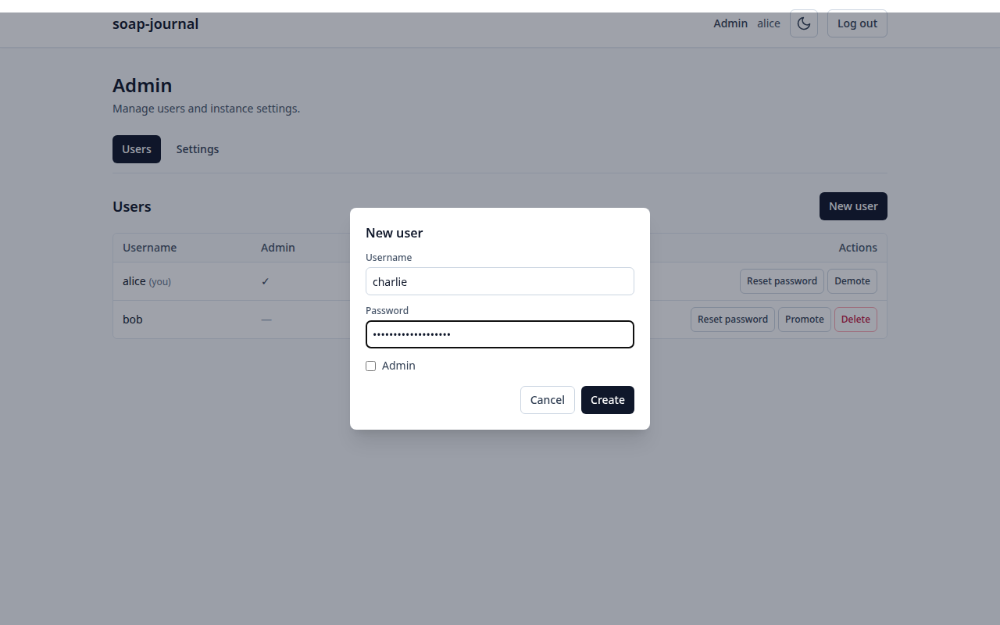
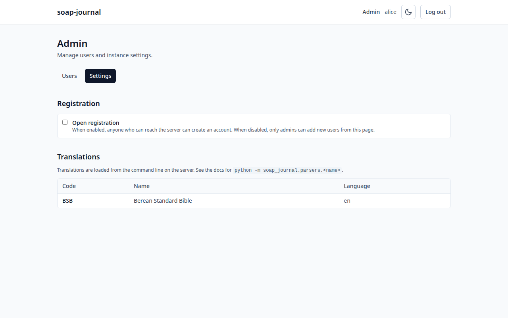

# 8. Admin tasks

This chapter is for **administrators only**. Non-admin users can skip it;
the Admin link in the top bar doesn't show up for non-admins, and the
admin pages reject requests from non-admin accounts.

The first user to register on a new instance is automatically an admin.
After that, admins can promote other users.

## Getting to the admin pages

Click **Admin** in the top bar:



The page has two tabs:

- **Users** — manage user accounts.
- **Settings** — toggle instance-wide settings and view loaded
  translations.

## Users tab

A table of every user on the instance:

- **Username** — the lowercase username. Your own row is marked
  *(you)*.
- **Admin** — a check (`✓`) for admins, dash (`—`) for regular users.
- **Created** — the date the account was created.
- **Actions** — buttons described below.

### Create a new user

Click **+ New user** in the top right:



Fill in:

- **Username** — the same rules as registration (3–32 characters,
  letters / digits / underscore / hyphen). Stored lowercase.
- **Password** — at least 8 characters. **You set the initial password
  yourself**, then share it with the new user privately. (There is no
  email-based invitation in v0.1.) They can't reset it themselves —
  ask them to log in and then ask you to reset it via the next
  section if they want a different one.
- **Admin** — check this box if the new user should also be an admin.
  Leave unchecked for a regular user.

Click **Create** to save. The user is created immediately; they can
log in right away with the username and password you set.

> **You don't need to enable open registration to create users.**
> Open registration is a separate switch (see [Settings](#settings-tab)
> below) that lets *anyone with the URL* sign themselves up. Admin
> account creation works regardless of that setting and is the safer
> default for a household instance: you decide who has an account.

### Reset a user's password

Click **Reset password** next to any user. A dialog appears with one
field: **New password**. Type it, click **Reset**.

The user is forcibly logged out everywhere — every device they're
signed in on gets kicked out — and has to log in again with the new
password.

This is how a user recovers from a forgotten password: they ask you to
reset it.

### Promote / Demote

The button next to **Reset password** says either **Promote** (for
regular users — clicking it makes them an admin) or **Demote** (for
admins — clicking it strips their admin role).

There's no confirmation dialog; the toggle is immediate.

### Delete a user

The **Delete** button (only shown for users other than yourself)
removes the account permanently, including every entry, tag, and
session that belonged to it. There's a confirmation step. **There is
no undo.**

### The "last admin" protection

You can't demote or delete yourself if you're the only admin on the
instance. If you try, the action fails with a *"Last admin"* error.
This is to prevent locking the entire instance out of the admin pages.

To get around it: first promote someone else to admin, *then* demote
or delete yourself. Make sure that someone else actually knows their
password before you do.

## Settings tab

Click **Settings** under the Admin header:



### Open registration

A single checkbox. When **on**, anyone with the URL can register their
own account from the Register tab on the login page. When **off**
(the default), the Register tab returns a "Registration is closed"
error unless the instance has no users yet.

Common setups:

- **Family / household instance** — leave registration closed. Create
  accounts manually for each person. Nobody who lands on your URL by
  accident can sign up.
- **Small group / study group instance** — turn registration on
  briefly while everyone signs up, then turn it back off. Same effect
  as creating accounts manually, but lets people pick their own
  password.

The toggle takes effect immediately; no restart needed.

### Translations

A table of every Bible translation currently loaded into your
instance. v0.1 ships with the **Berean Standard Bible (BSB)**
pre-loaded.

The table shows the translation **code**, **name**, and **language**.
It is read-only in v0.1 — you can't add translations from the
web UI. To load another translation:

1. Write or use a parser that converts the source format (USFM, OSIS,
   etc.) into the canonical JSON format. See the project's
   [`CONTRIBUTING.md`](../../CONTRIBUTING.md) for the schema.
2. Run the parser to produce a JSON file.
3. Load the JSON into the database with the CLI:

   ```bash
   docker compose exec soap-journal \
     python -m soap_journal.cli load-translation /path/to/translation.json
   ```

The new translation appears in the table on the next page refresh.
Users can then pick it as the default in their entry form's
**Translation** dropdown, and the **Compare translations** affordance
in the reader becomes active.

**Note on copyright:** only translations you have the legal right to
redistribute should be loaded on a publicly-accessible instance. The
BSB is in the public domain; most modern translations (ESV, NIV, NASB,
CSB, etc.) are not. Loading a copyrighted translation onto a server
you control for personal household use is between you and the
publisher.

---

Previous: [Calendar and "on this day"](07-calendar-and-on-this-day.md) · Next: [Backups and updates →](09-backups-and-updates.md)
